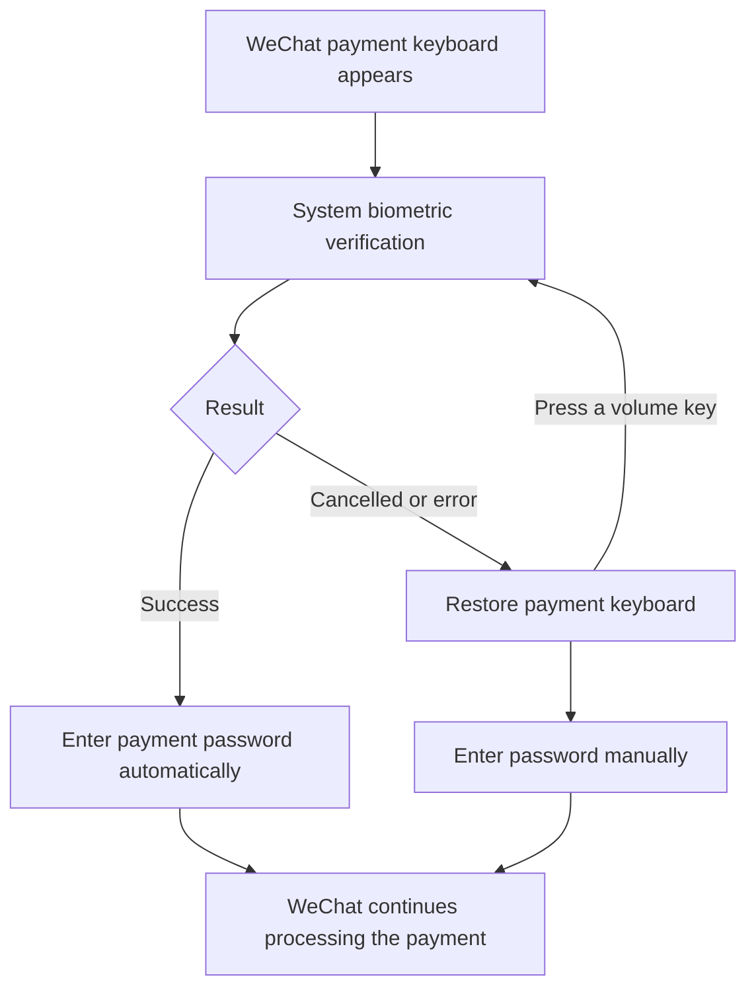

<h1>BioPay</h1>

验证指纹或面容，轻松完成微信支付

Pay in WeChat with your fingerprint or face

[简体中文](README.md) | [English](README_EN.md)

## Introduction

**BioPay** lets you verify your fingerprint or face to enter your WeChat payment password automatically, including on devices where WeChat does not offer biometric payment.

It supports payments within WeChat and WeChat payments opened by other apps, with compatibility for some devices that only support Class 1 face recognition. Availability depends on your phone, enrolled biometrics, and WeChat version.

## Screenshots

  

## Features

| Feature | What you can do |
| --- | --- |
| Fingerprint, face, or both | Choose your preferred authentication mode |
| Automatic password entry | Verify when the payment keyboard appears |
| Class 1 face compatibility | Use supported face sensors without an additional compatibility module |
| Manual fallback | Return to the payment keyboard after cancellation or an error |
| Volume key shortcut | Cancel verification or start it again from the keyboard |
| Local encrypted storage | Keep your password encrypted on your device; the module does not connect to the internet |

## Payment Flow

If recognition fails, you can try again. BioPay assists with password entry; WeChat determines whether the payment succeeds.

## Installation and Setup

**Requirements:** Android 9.0 or newer, LSPosed with LibXposed API 102 support, and an enrolled fingerprint or face. Only WeChat is currently supported.

1. Download and install the release APK from [Releases](https://github.com/kiriashi/BioPay/releases).
2. Enable BioPay in LSPosed and select the WeChat scope.
3. Force-stop WeChat, then open it again.
4. Go to WeChat **Me → Settings**, then long-press the page title **Settings** to open BioPay settings.
5. Enter your six-digit WeChat payment password, choose fingerprint, face, or both, and verify to save.
6. Follow the system verification prompt on your next payment.

### Devices with Class 1 Face Recognition

Also enable BioPay's **System Framework (system)** scope in LSPosed, disable any separate FaceBiometricFix or similar compatibility module, and **reboot your phone**. Select face or both in BioPay settings.

Reboot after enabling or updating this compatibility feature; restarting WeChat alone is insufficient. For fingerprints or face sensors already supported for payment, start with just the WeChat scope.

This feature changes how the system evaluates biometric strength and may affect other apps. It does not improve the sensor's actual resistance to spoofing. Decide whether to enable it based on your device.

## Everyday Use

- **Change authentication mode:** Open BioPay settings, select a mode, and verify to save. The sensor ultimately selected also depends on your device.
- **Enter the password manually:** Cancel verification or press a volume key during verification to return to the keyboard.
- **Verify again:** Press a volume key once while the payment keyboard is visible.
- **Disable BioPay:** Turn off both fingerprint and face switches and save to return to normal password payment.
- **Clear your password:** Long-press the clear button in settings and verify when prompted.

## Privacy and Security

- Your password is encrypted locally. The module does not request internet permission or upload passwords or biometric information.
- The system performs biometric recognition. BioPay decrypts and enters the password only after successful verification.
- Face compatibility does not provide hardware-bound biometric protection for password decryption.
- Source code is available under [AGPL-3.0](LICENSE). Releases no longer include a debug APK.

## Troubleshooting

Check that the module and required scopes are enabled, your biometrics are enrolled, and you have rebooted after updating. If a WeChat update breaks the feature, report your phone model, Android, WeChat, and LSPosed versions, steps to reproduce, and error messages in [Issues](https://github.com/kiriashi/BioPay/issues). Never share your payment password.

You can also join the [Telegram group](https://t.me/biopaychat).

## License and Disclaimer

Copyright (C) 2026 kiriashi. Licensed under the [GNU Affero General Public License v3.0 or later](LICENSE). Modifications and redistribution must comply with the license.

Use only on devices and accounts you are authorized to use and modify, and follow applicable laws and platform rules. This project provides no warranty. You are responsible for account, data, and payment risks arising from its use.
